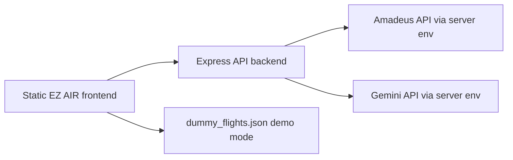

# EZ AIR

AI flight-search UX demo built with a static HTML/CSS/Vanilla JS frontend and an Express API backend. EZ AIR began as a frontend/team project and later became a useful portfolio artifact for natural-language travel search, flight-result comparison, and safe API-key handling.

[Live demo](https://ezair.oosu.dev) · [GitHub](https://github.com/oosuhada/ezair.ai)


## 한국어 요약

EZ AIR는 항공권 검색 UI를 기반으로 **자연어 여행 검색과 AI assistant interaction**을 실험한 초기 풀스택 프로젝트입니다. HTML/CSS/Vanilla JavaScript로 만든 프론트엔드에 Express API 경계를 추가해 Amadeus/Gemini 같은 외부 provider key가 브라우저에 노출되지 않도록 구조를 정리했습니다.

- 항공권·호텔·패키지·고객센터·예약 결과 화면으로 구성된 여행 서비스 UI
- 자연어 항공 검색을 위한 AI assistant modal
- Amadeus/Gemini 연동을 server-side Express API 뒤로 이동
- API key 없이도 포트폴리오를 검토할 수 있는 mock/demo mode
- 현재의 Next.js/AI 제품으로 발전하기 전 Vanilla JS 기반 구현 역량을 보여주는 기록

과거 Vercel 주소는 현재 production deployment가 없어 더 이상 대표 live link로 사용하지 않습니다. 이 README의 Live demo는 현재 운영 환경으로 이전한 주소만 가리키도록 관리합니다.

## What This Shows

- Natural-language flight-search interaction design using an AI assistant modal.
- Static travel-site frontend with flight, hotel, package, customer-service, and reservation pages.
- Express backend boundary for Amadeus and Gemini integration instead of browser-side secret usage.
- Mock/demo mode for public portfolio review without provider keys.
- A clear migration path from a vanilla frontend into Vite/TypeScript and eventually a fuller Next.js architecture.

## Architecture



```text
ezair.ai/
├── index.html                  # main flight-search page
├── script/                     # vanilla search/AI interaction scripts
├── style/                      # page and search-result styles
├── backend/                    # Express API boundary
├── pages/                      # hotels, package tour, CS, reservation result
├── image/                      # travel and airline UI assets
└── video/                      # intro airplane-window motion asset
```

## Security And Public Sharing Notes

- `GEMINI_API_KEY`, `AMADEUS_API_KEY`, and `AMADEUS_API_SECRET` must live only in server-side `.env` files.
- Browser code should never assign provider keys to `window` or `NEXT_PUBLIC_` variables.
- The public demo runs in development/mock mode unless a backend is configured.
- Any provider key that was previously committed in `index.html` should be treated as exposed and revoked/rotated.

## Run Locally

Frontend:

```bash
python3 -m http.server 5500
```

Backend:

```bash
cd backend
npm install
npm start
```

Create backend `.env` from placeholder values only:

```text
PORT=3000
AMADEUS_API_KEY=
AMADEUS_API_SECRET=
GEMINI_API_KEY=
```

## Validate

```bash
node --check script/gemini_search.js
```

Open `http://localhost:5500/index.html` and confirm the AI search demo uses mock data unless the backend is configured.
