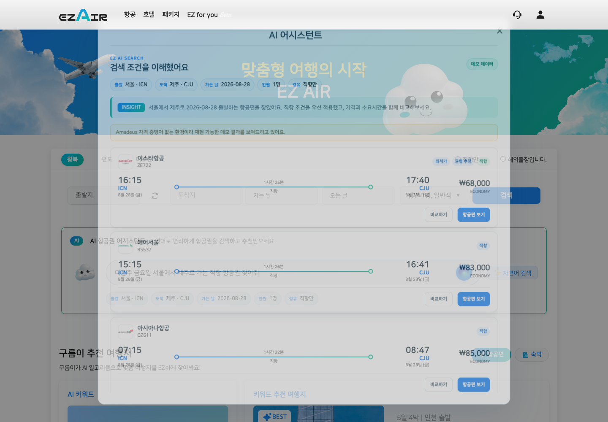
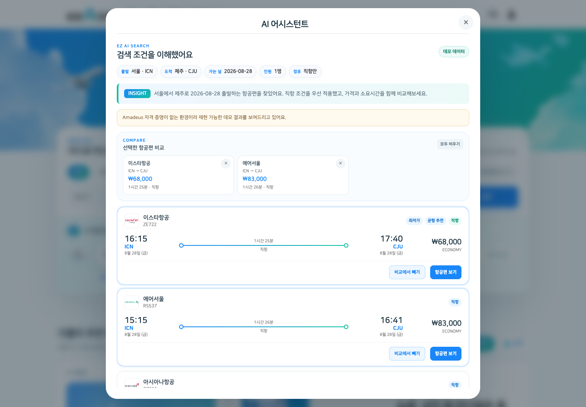
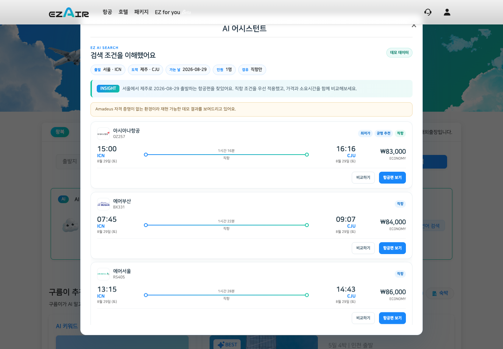
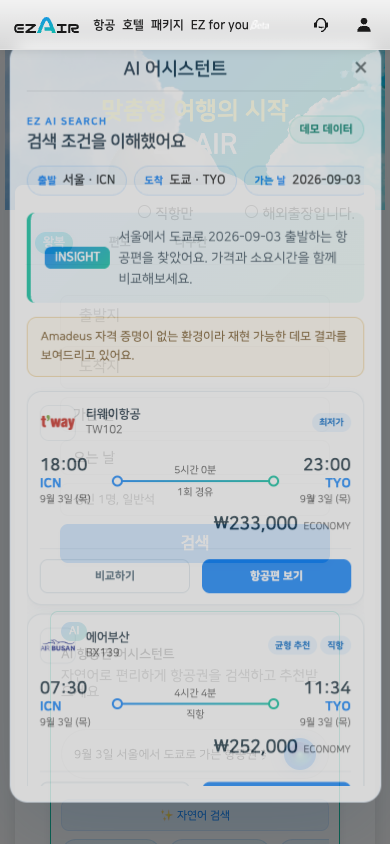
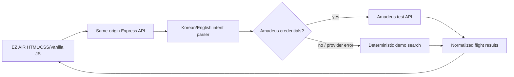

# EZ AIR — AI로 쉬워진 항공권 검색

**EZ AIR**는 항공권 검색에서 반복되는 폼 입력을 줄이고, 사용자가 여행 계획을 **한 문장으로 말하면 검색 조건으로 바꿔주는 natural-language flight search product**입니다.

항공권 사이트를 사용할 때 가장 불편했던 순간은 검색 결과가 아니라 날짜나 도시 하나를 바꿀 때마다 처음부터 폼을 다시 작성하는 과정이었습니다. EZ AIR는 이 문제를 대화형 검색으로 풀어, 사용자가 원하는 여행을 설명하면 조건을 이해하고 비교 가능한 결과를 제공합니다.

기존 EZ AIR의 한국어 중심 UI, blue → green color system, 여행 서비스 레이아웃, 그리고 **비행기 창이 AI 검색창으로 변하는 signature intro**를 제품의 중심에 그대로 두고, 자연어 intent parsing·실제 검색 API 경계·검색 조건 수정·결과 비교·명확한 demo fallback을 추가해 초기 프로토타입을 실제 사용할 수 있는 형태로 보강했습니다.

**Live**: https://ezair.oosu.dev

<p align="center">
  
</p>

## Why I Built It / 만든 이유

Flight search involved tedious friction — returning to the home screen to reset filters for every minor date change and juggling separate notes just to compare options. With conversational LLMs emerging but not yet applied to flight booking, I built a natural-language search product where travelers can adjust conditions and compare itineraries seamlessly through plain dialogue.

항공권을 검색할 때 날짜나 도시를 바꾸려면 매번 홈 화면으로 돌아가 폼을 처음부터 다시 채워야 했고, 여러 조건을 비교하려면 따로 메모해야 하는 번거로움이 있었습니다. 당시 LLM과 챗봇 기술이 급부상하고 있었지만 항공권 검색에 접목된 서비스는 없었기에, 대화 한 번으로 조건 변경과 일정 탐색을 끝낼 수 있는 자연어 항공권 검색을 직접 만들었습니다.

## 제품 방향 / Product Direction

항공권을 찾을 때 가장 번거로운 순간은 검색 결과 자체보다, 날짜나 인원·도착지를 조금 바꿀 때마다 긴 폼을 다시 조작해야 하는 과정입니다.

EZ AIR는 이 문제를 두 가지 검색 방식으로 해결합니다.

- **EZ AI 자연어 검색** — `다음주 금요일 서울에서 제주로 가는 직항 항공권 찾아줘`처럼 한 문장으로 검색
- **기존 항공권 폼** — 출발지·도착지·날짜·인원·좌석을 직접 선택하는 익숙한 검색 방식

두 방식 모두 같은 Express API 경계를 사용하며, provider credential이 있을 때는 **Amadeus test API**를 우선 사용하고, 없는 환경에서는 검색·비교·수정 UX를 그대로 검증할 수 있는 **deterministic demo fallback**을 사용합니다. Demo 결과는 UI에서 명확하게 표시합니다.

## Signature Intro

EZ AIR의 첫 화면은 단순 splash screen이 아닙니다.

1. 검은 화면 위에 세로형 **비행기 창**이 회전하며 등장합니다.
2. 창 안에서 실제 기내 창밖 영상과 구름이 움직입니다.
3. 큰 비행기 이미지가 화면을 대각선으로 가로지릅니다.
4. 창 안 영상이 사라지고, **그 비행기 창 자체가 EZ AI 검색창 크기와 위치로 morph**합니다.
5. `다음주 금요일 서울에서 제주도 가는 가장 저렴한 항공권 찾아줘`가 타이핑되며 메인 화면이 자연스럽게 드러납니다.

같은 브라우저 탭에서는 `sessionStorage`를 사용해 한 번만 재생되므로 반복 탐색을 방해하지 않습니다.

## EZ AI Search Flow

### 1. 문장을 검색 조건으로 이해

입력 중인 문장에서 이해한 내용을 chip으로 즉시 보여줍니다.

- 출발 / 도착
- 가는 날 / 오는 날
- 인원
- 직항 여부
- 좌석 등급
- 예산 표현

예:

```text
다음주 금요일 서울에서 제주로 가는 직항 항공권 찾아줘
→ 출발 서울 · ICN
→ 도착 제주 · CJU
→ 가는 날 2026-08-28
→ 인원 1명
→ 경유 직항만
```

### 2. 실제 검색 상태만 표시

고정 시간을 흉내 내는 fake progress 대신 실제 동작 단계에 맞춰 상태를 전환합니다.

```text
여행 조건 이해
→ 항공편 검색
→ 가격·시간 비교
```

### 3. 결과를 비교 가능한 정보로 정리

현재 검색 결과를 기준으로 자동 계산한 label을 표시합니다.

- **최저가**
- **최단시간**
- **균형 추천** — 가격·소요시간·경유 수를 함께 계산
- **직항**

최대 **3개 항공편**을 선택해 같은 화면에서 가격, 소요시간, 직항 여부를 나란히 비교할 수 있습니다.

### 4. 검색 조건을 대화처럼 수정

결과 화면에서 처음부터 다시 입력할 필요가 없습니다.

```text
하루 늦춰줘
2명으로 바꿔줘
직항만 보여줘
경유도 괜찮아
런던 말고 파리로
```

기존 route/date/passenger context를 유지한 채 변경된 조건만 적용하고 다시 검색합니다.

## Preview

<table>
  <tr>
    <td align="center" width="50%">
      <br>
      <sub><b>Signature intro</b> · 원본 비행기 창 → AI 검색창 전환</sub>
    </td>
    <td align="center" width="50%">
      <br>
      <sub><b>Natural-language search</b> · 문장에서 이해한 조건을 chip으로 표시</sub>
    </td>
  </tr>
  <tr>
    <td align="center" width="50%">
      <br>
      <sub><b>Flight results</b> · 최저가/최단시간/균형 추천/직항 label</sub>
    </td>
    <td align="center" width="50%">
      <br>
      <sub><b>Compare</b> · 최대 3개 항공편 side-by-side 비교</sub>
    </td>
  </tr>
  <tr>
    <td align="center" width="50%">
      <br>
      <sub><b>Modify search</b> · “하루 늦춰줘”처럼 기존 조건을 유지한 재검색</sub>
    </td>
    <td align="center" width="50%">
      <br>
      <sub><b>Mobile</b> · 390px viewport에서도 검색/결과/비교 흐름 유지</sub>
    </td>
  </tr>
</table>

## UI / UX Polish

기능을 추가하는 것만큼 **기존 EZ AIR의 화면 밀도와 정보 계층을 정리하는 것**을 중요하게 봤습니다. 원래의 blue → green 브랜드 컬러와 여행 서비스 분위기는 유지하되, 페이지가 하나의 긴 카드처럼 보이던 구조를 독립적인 product section으로 다시 나눴습니다.

- Hero와 검색 카드를 자연스럽게 겹쳐 첫 화면의 depth와 집중도를 강화
- 12 / 18 / 24px radius와 일관된 border·shadow·spacing token으로 화면 리듬 통일
- EZ AI 입력 영역을 검색 카드의 핵심 visual anchor로 강화
- 결과 modal의 카드·비교·검색 수정 영역을 같은 hierarchy와 spacing system으로 정리
- 390px 모바일에서는 출발/도착, 날짜, 인원/검색을 2열로 구성해 AI 검색창까지의 스크롤을 단축
- 작은 화면의 테마 여행지는 긴 세로 목록 대신 horizontal snap rail로 변경
- 기존 100px slide-in / 2초 stagger motion을 더 짧고 미세한 motion으로 조정
- 1440 / 1024 / 390 / 320px viewport에서 horizontal overflow 없이 검증

## Runtime Architecture



```text
ezair.ai/
├── index.html
├── style/
│   ├── intro.css
│   ├── ai_search.css
│   ├── ai_results.css
│   ├── polish.css              # spacing / depth / responsive product polish
│   └── ...
├── script/
│   ├── intro.js
│   ├── ai_search.js
│   ├── amadeus_search.js
│   └── script.js
├── backend/
│   ├── routes/
│   │   ├── ai.js
│   │   └── amadeus.js
│   ├── services/
│   │   ├── intentParser.js
│   │   ├── flightSearchProductService.js
│   │   ├── demoSearchService.js
│   │   └── amadeusService.js
│   └── tests/
├── pages/
├── image/
└── video/
```

## API Behaviour

### `POST /api/ai-intent`

자연어 문장을 검색 context로 해석합니다.

```json
{
  "query": "다음주 금요일 서울에서 제주로 가는 직항 항공권 찾아줘"
}
```

### `POST /api/ai-search`

신규 검색 또는 기존 context를 유지한 수정 검색을 수행합니다.

```json
{
  "query": "하루 늦춰줘",
  "context": {
    "origin": "ICN",
    "destination": "CJU",
    "departDate": "2026-08-28",
    "adults": 1,
    "travelClass": "ECONOMY",
    "nonStop": true
  }
}
```

### `GET /api/search-locations` / `POST /api/search-flights`

기존 structured search form에서 사용합니다. Amadeus credential이 없거나 provider request가 실패할 경우에도 local location index와 demo result로 UX가 끊기지 않습니다.

## Run Locally

프런트와 API를 별도 포트로 띄울 필요 없이 **Express 한 프로세스**로 실행합니다.

```bash
cd backend
npm ci
npm start
```

브라우저에서:

```text
http://localhost:3000
```

환경 변수:

```text
PORT=3000
HOST=0.0.0.0
AMADEUS_API_KEY=
AMADEUS_API_SECRET=
```

Amadeus 값이 비어 있으면 자동으로 deterministic demo mode를 사용합니다. Provider secret은 브라우저 코드에 포함하지 않습니다.

## Validate

```bash
cd backend
npm test

cd ..
node --check script/intro-20260821-directexit.js
node --check script/ai_search.js
node --check script/amadeus_search.js
node --check backend/server.js
```

현재 parser test는 다음 흐름을 검증합니다.

- `다음주 금요일 서울에서 제주로 ... 직항`
- `하루 늦춰줘`
- `2명으로 바꾸고 직항만`
- `런던 말고 파리로`

## Safety / Fare Accuracy

- 현재 live-provider 연동은 **Amadeus test API** 기준입니다.
- Credential이 없는 환경의 결과는 **데모 데이터**라고 UI에 명시합니다.
- Demo 결과는 route/date/조건에 따라 deterministic하게 생성되지만 실제 판매 운임이 아닙니다.
- 실제 예약 전에는 항공사 또는 판매처의 최종 운임·수하물·환불 조건을 다시 확인해야 합니다.
- `AMADEUS_API_KEY`와 `AMADEUS_API_SECRET`은 server-side environment에만 둡니다.

---

### English Summary

EZ AIR is a Korean-first flight-search product that keeps its original blue/green travel UI and signature airplane-window intro, then strengthens the product layer with structured natural-language intent parsing, same-origin Express APIs, Amadeus-first search, deterministic demo fallback, derived result labels, up-to-three-flight comparison, and contextual search modification.

The goal is not to replace the original EZ AIR identity with a new product shell. The current version treats the original experience as the product foundation and improves the parts that previously behaved like a prototype.

## Topics

[`amadeus-api`](https://github.com/topics/amadeus-api) · [`express`](https://github.com/topics/express) · [`flight-search`](https://github.com/topics/flight-search) · [`full-stack`](https://github.com/topics/full-stack) · [`javascript`](https://github.com/topics/javascript) · [`natural-language-search`](https://github.com/topics/natural-language-search) · [`travel-tech`](https://github.com/topics/travel-tech) · [`vanilla-js`](https://github.com/topics/vanilla-js) · [`travel`](https://github.com/topics/travel) · [`chatbot`](https://github.com/topics/chatbot) · [`nodejs`](https://github.com/topics/nodejs) · [`api-integration`](https://github.com/topics/api-integration) · [`conversational-ai`](https://github.com/topics/conversational-ai) · [`web-app`](https://github.com/topics/web-app) · [`amadeus`](https://github.com/topics/amadeus) · [`flight-booking`](https://github.com/topics/flight-booking)
