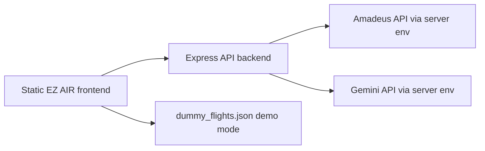

# EZ AIR

AI flight-search UX demo built with a static HTML/CSS/Vanilla JS frontend and an Express API backend. EZ AIR began as a frontend/team project and later became a useful portfolio artifact for natural-language travel search, flight-result comparison, and safe API-key handling.

[Live demo](https://ezair-ai.vercel.app) · [GitHub](https://github.com/oosuhada/ezair.ai)


## What This Shows

- Natural-language flight-search interaction design using an AI assistant modal.
- Static travel-site frontend with flight, hotel, package, customer-service, and reservation pages.
- Express backend boundary for Amadeus and Gemini integration instead of browser-side secret usage.
- Mock/demo mode for public portfolio review without provider keys.
- A clear migration path from a vanilla frontend into Vite/TypeScript and eventually a fuller Next.js architecture.

## Architecture



```text
ezair.ai/
├── index.html                  # main flight-search page
├── script/                     # vanilla search/AI interaction scripts
├── style/                      # page and search-result styles
├── backend/                    # Express API boundary
├── pages/                      # hotels, package tour, CS, reservation result
├── image/                      # travel and airline UI assets
└── video/                      # intro airplane-window motion asset
```

## Security And Public Sharing Notes

- `GEMINI_API_KEY`, `AMADEUS_API_KEY`, and `AMADEUS_API_SECRET` must live only in server-side `.env` files.
- Browser code should never assign provider keys to `window` or `NEXT_PUBLIC_` variables.
- The public demo runs in development/mock mode unless a backend is configured.
- Any provider key that was previously committed in `index.html` should be treated as exposed and revoked/rotated.

## Run Locally

Frontend:

```bash
python3 -m http.server 5500
```

Backend:

```bash
cd backend
npm install
npm start
```

Create backend `.env` from placeholder values only:

```text
PORT=3000
AMADEUS_API_KEY=
AMADEUS_API_SECRET=
GEMINI_API_KEY=
```

## Validate

```bash
node --check script/gemini_search.js
```

Open `http://localhost:5500/index.html` and confirm the AI search demo uses mock data unless the backend is configured.
